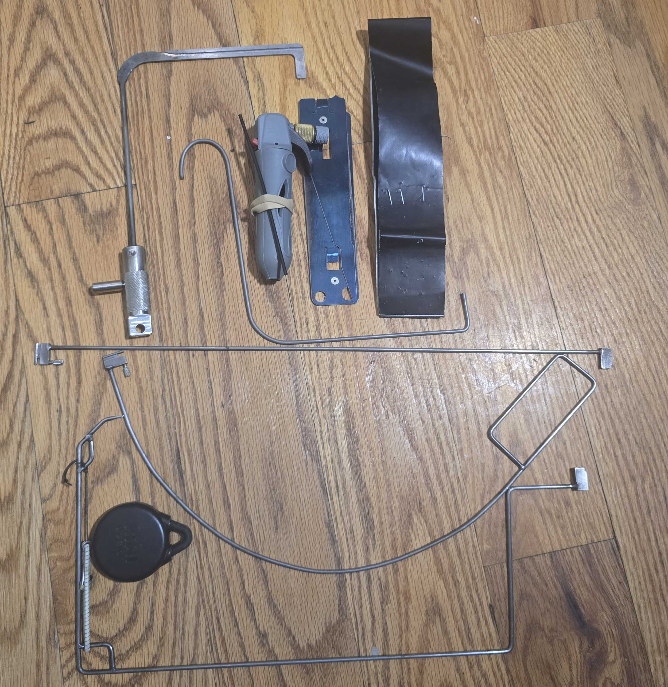

# Tools
A list of different tools that are frequently used in Physical Red Teaming. A
good collection of physical security tools can be found at [Red Team
Tools](https://www.redteamtools.com/)

## [Flipper Zero](https://flipper.net/)
This tool serves as a kind of swiss-army knife for physical pentesters due to
its ability to read and manipulate various radio, access control systems,
hardware, etc. Imagine a tool that could clone a badge used to enter a building
or open a garage with a button and you probably get the idea of why this would
be particularly useful! It is open source with lots of documentation at its
homepage.

## [Under Door Tool (UDT)](https://www.redteamtools.com/under-door-level-lock-tool)
Opens a door from the other side. When used on a standard US office door,
it often eliminates the need for lock-picking or other bypass mechanisms.

## The Sacred Six
According to a Discord user on [Physical Security Village](Communities.md#PSV),
the sacred six is a collection of the best tools for physical pentesting:

_I call this the sacred six, these six tools will get you into the majority of
office buildings in the united states. The bottom 3 are my custom under the
door tool, the one above it is for bypassing blumfield style glass doors,
something so common on the front doors to tech office buildings that type of
tool is called the key to silicon valley, from top left to top right: a tool
for bypassing french doors,the hook end of the silicon Valley key, a co2 bike
tire inflator i 3d printed an adapter for a small straw for blowing gas under
or in-between doors to trip passive infrared request to exit sensors, a
foldable and extensable hook for bypassing doors with a improperly fitted dead
latch and infrared reflective fabric for tripping those active infrared request
to exit buttons you just wave your hand across to unlock the door_
